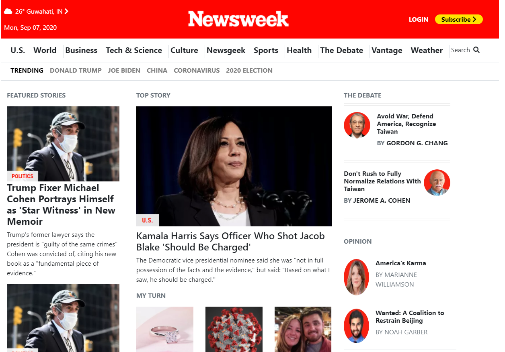
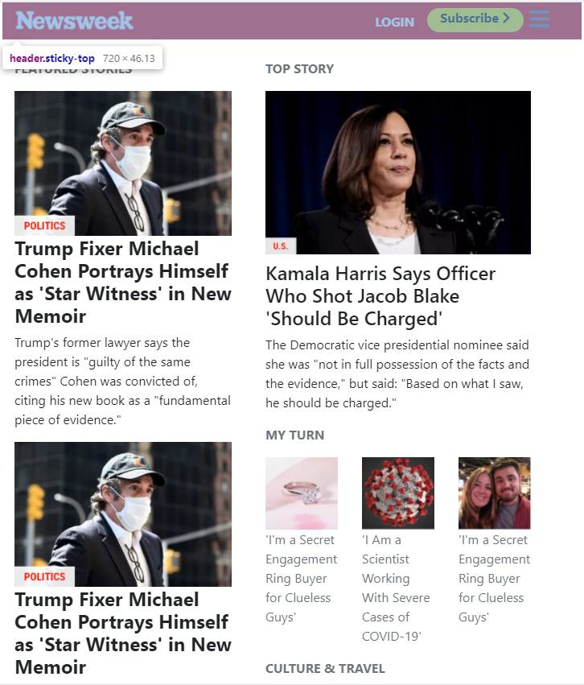
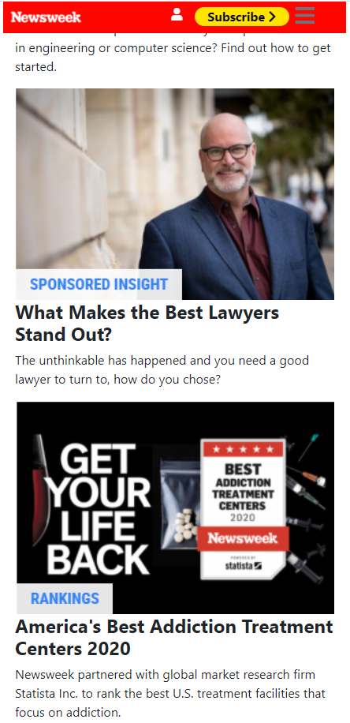

# Bootstrap Project Newsweek Clone

Second project of Nick Kuria and Abhigyan Mahanta

 

 

<h1>Additional description about the project and its features.</h1>

This is a project to demonstrate the exisiting knowledge of HTML, CSS and Bootstrap. It is a collaborative project which shows the clone of newsweek.com.

<i>Built With HTML5, CSS3, GIT, and VSCODE</i>

Live Demo : https://newsweekcloning.netlify.app/

<h1>Getting Started</h1>

To get a local copy up and running follow these simple example steps.

1. Go to https://github.com/Abhigyan001/Bootstrap_Newsweek/tree/feature
2. Click on code and copy the html code.
3. Use git bash to clone this repository on your local machine.
4. Run git checkout -b your-branch-name Make your contributions
5. Push your branch up to your forked repository
6. Open a Pull Request with a detailed description to the development branch of the original project for a review

Prerequisites Text editor, Github profile and Git.

<h2>Authors</h2>

👤 Nick Kuria

- Github: [@githubhandle](https://github.com/Nkuria)
- Linkedin: [linkedin](https://www.linkedin.com/in/nick-kuria-a148931a9/)

👤 ABHIGYAN Mahanta

- Github: @Abhigyan001
- Linkedin: [Abhigyan](https://www.linkedin.com/in/abhigyanmahanta/)

🤝 Contributing Contributions, issues and feature requests are welcome!

Feel free to check the issues page.

Show your support Give a ⭐️ if you like this project!

📝 License This project is a collaboration project of microverse students. All rights are reserved for Ntwali and Abhigyan.
